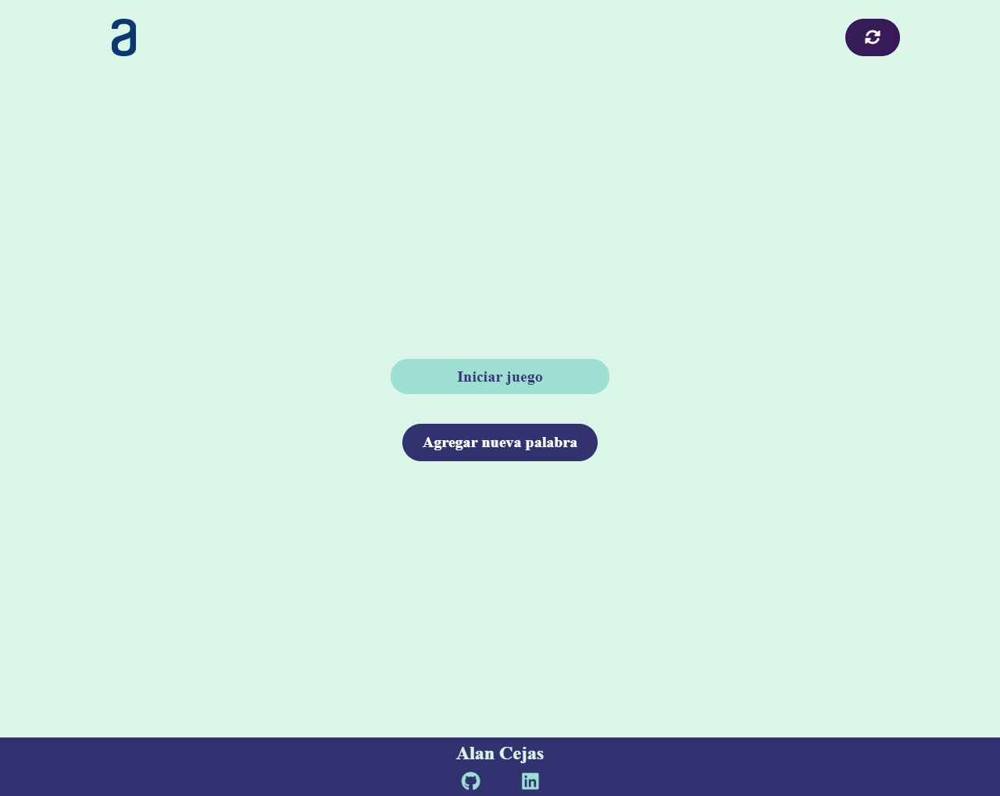
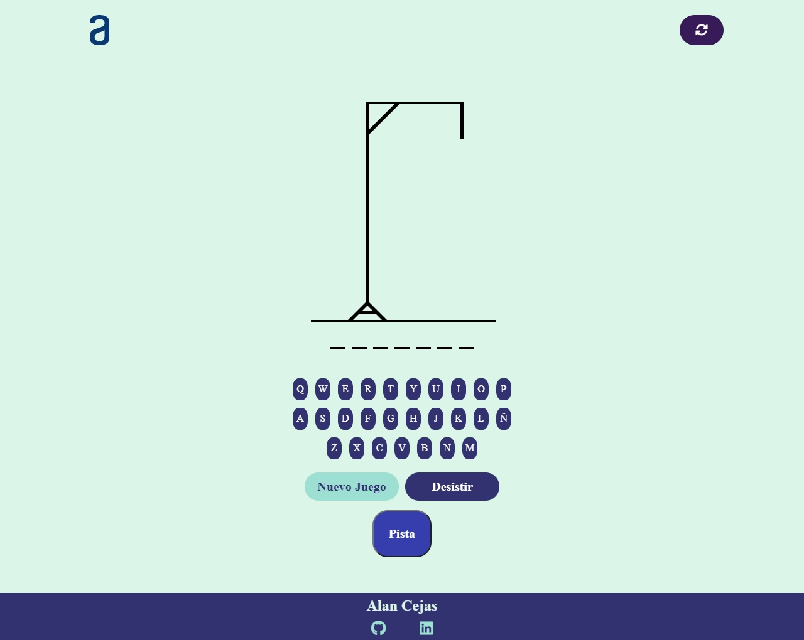
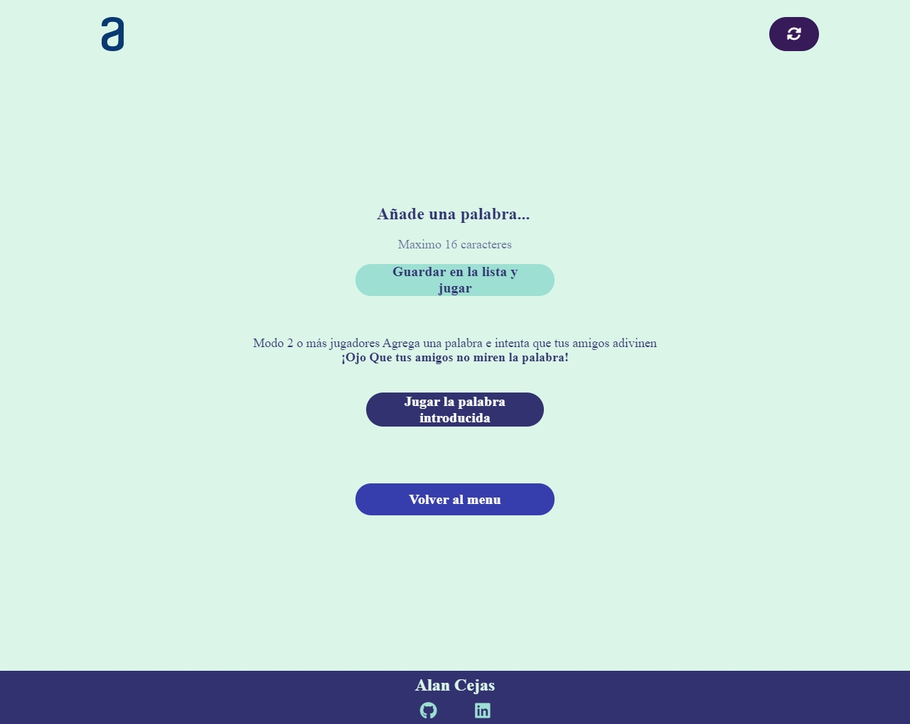

# Juego del Ahorcado | Challenge #2 ONE

En esta desafio realizamos el juego del ahorcado con lo aprendido en html css y js.

## Requisitos:
- Debe funcionar solo con letras mayúsculas;
- No deben ser utilizadas letras con acentos ni caracteres especiales;
- Al completar o dibujo de la horca, debe ser mostrado un mensaje "Fin del juego" en la pantalla;
- Si se completa la palabra correcta antes de que se acaben los intentos, debe ser mostrado un mensaje de "Ganaste, Felicidades!" en la pantalla.
- La página debe tener los guiones indicando cada letra da palabra, separados por un espacio;
- Para comenzar el juego la página debe tener un botón de "Iniciar Juego";
- No debe ser posible escribir números dentro del juego.
- Las letras equivocadas deben aparecer en la pantalla, pero no pueden aparecer de forma repetida;
- Las letras correctas deben aparecer en la pantalla encima de los guiones, en la posición correcta em relación a la palabra.

### Extras:
- La página debe tener un campo para inserción de texto con la finalidad de adicionar nuevas palabras al juego, e un botón "Agregar palabra".

## Tecnologias utilizadas

  

## Funcionamiento

El proyecto tiene 3 vistas:

### Menú principal:

  

En el menú principal encontraremos dos botones el de nuevo juego que inicia el juego y el de agregar una palabra.

### Sección Nuevo Juego

  

Inicia un nuevo juego eligiendo una palabra al azar de la lista de palabras y empieza el conocido juego del ahorcado hay botones en la pantalla para seleccionarlos con el mouse y tambien se puede usar el teclado.
- Tiene un botón de nuevo juego para empezar otra partida.
- Un botón de desistir para terminar el juego y volver al menú principal.
- Botón de pista que mostrará una letra aleatoria que use la palabra secreta. Para palabras mayores a 4 letras hay 2 pistas para menores solo una.

### Sección agrega una palabra

  

En esta sección podemos agregar una palabra a la lista de palabras o usar una palabra para iniciar un juego con esta misma para jugar.

- Botón para agregar la palabra introducida a la lista de palabras e iniciar un nuevo juego.
- Botón para jugar una partida con la palabra introducida para jugar con 1 o más amigos de forma local.
- Botón para volver al menú principal.

### **Puedes ver la Demostración del proyecto [Aqui](https://alandcejas01.github.io/challenge2-ONE-Juego-del-Ahorcado/).**